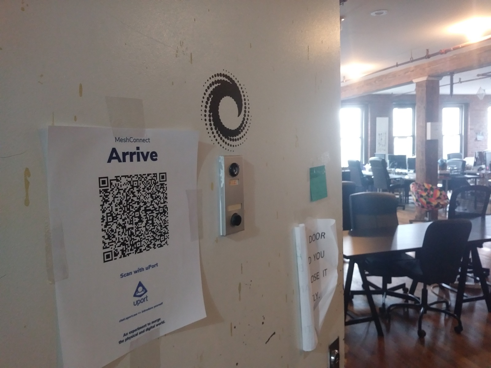

# MeshConnect

An experiment to merge the physical and digital world using decentralized identity.

uPort has the ability to scan QR codes for generating decentralized identity attestations, but also interact with the Ethereum blockchain by signing transactions requests. The QR codes can either be dynamically generated in a digital environment or static and anchored to a physical location.

The MeshConnect experiment leverages uPort's ability to sign transaction in the physical world - leaving the confines of a Browser environment.

### PunchTheClock.sol
The `PunchTheClock.sol` smart contract provides uPort decentralized identities to `register`, `arrive` and `depart` from a physical location.

Before uPort decentralized identities can scan the physical `arrive` and `depart` QR code smart contract function requests the `admin` must `adminApprove` the decentralized identity after the `register` transaction has been completed. This deincentivizes QR codes being shared outside the event, because it's not possible to actually arrive or depart, unless you've been approved.

Additionally basic `time/epoch` logic has been implemented to require incentivize participants to stay at a certain location for X amount of time. The `timeMin` and `timeMax` parameters are used to guide optimial participation times.

For example participants are encouraged to `arrive` and stay minimum hour, but are encouraged to leave before 2 hours. In the future the `PunchTheClock.sol` smart contract will include `payable` functions, so particpants have to stake `ether` during arrival, but it will be returned upon an optimal departure. 

Below are smart contract modifiers to implment the described logic.

```
/**
* Modifiers
*/
modifier isAdmin() {
    require(admin == msg.sender);
    _;
}

modifier isApproved() {
    require(entityList[msg.sender].isApproved == true);
    _;
}

modifier isComplete() {
    require(now >= entityList[msg.sender].timeArrived + timeMin); 
    _;
}

modifier isReasonable() {
    require(now <= entityList[msg.sender].timeArrived + timeMax); 
    _;
}

function isRegistered(address _address) public view returns(bool isIndeed) {
    return entityList[_address].isRegistered;
}
```

### Primary Decentralized Identity Interactions
A decentralized identity has 3 primary options and 1 secondary feature for interacting with a `PunchTheClock.sol` smart contract. The primary function calls are arrive, depart and register. The secondary interaction is adding a public name to the registry.

You can arrive/checkin an unlimited number of times. However, you can only depart once you've met certain criteria (which can be handled both digitally and in a physical environment), so a person is discouraged from `arriving` unless you can meet `departure` criteria.

For example I could have 100 arrivals, but maybe I never stay long enough to get permissions for `departure`:

a) I won't get back my staked ether (future version), so I'll be losing money

b) It looks bad (in a social context) because an uneven amount of arrivals/departures signal bad participation habits.

```
/**
  * Entity Privileges
  */
function name(string _name) public isApproved {
    entityList[msg.sender].name = _name;
}

function arrive() public isApproved {
    arrivalList[arrivalsCount].eid = msg.sender;
    arrivalList[arrivalsCount].time = now;
    entityList[msg.sender].isActive = true;
    entityList[msg.sender].arrivals++; 
    entityList[msg.sender].timeArrived = now;
    arrivalsCount++;
}

function depart() public isApproved isComplete isReasonable {
    departList[departuresCount].eid = msg.sender;
    departList[departuresCount].time = now;
    entityList[msg.sender].isActive = false;
    entityList[msg.sender].departures++;
    entityList[msg.sender].timeDeparted = now;
    departuresCount++;
}

function register() public {
    require(!isRegistered(msg.sender));
    entityList[msg.sender].isRegistered = true;
    entityList[msg.sender].isApproved = false;
    entityList[msg.sender].arrivals = 0;
    entityList[msg.sender].departures = 0;
    registeredList.push(msg.sender);
}
```


### Administrator Interactions
The smart contract `admin` is primarily responsible for approving event registrants.

Bounty Candidates:

- [ ] Intermediate Javascript - Create Administrator React Components to Approve `entities` using MetaMask Transaction Signing. To complete this task logic to dynamically include MetaMas as the Web3 provider needs to be added to the `ethers.js` Saga.

- [ ] Intermediate Smart Contract - Add Smart Contract function call to transfer `admin` privileges.

- [ ] Intermediate Smart Contract - Change Smart Contract initialization function to include an `admin` parameter so the default admin can be set on smart contract initialize that is NOT the creator.

- [ ] Intermediate Javascript - Create Administrator React Components to Approve `entities` using uPort.

- [ ] Advanced Javascript - Create React Components using `ethers` Redux Selectors/Sagas to filter participants based of approved status, amount of arrivals/departs and logic to match specific arrival and departure times.

```
/**
  * Administrator Privileges
*/
function adminApprove(address _address) public isAdmin {
    entityList[_address].isApproved = true;
}
function adminRevoke(address _address) public isAdmin {
    entityList[_address].isApproved = false;
}
function adminDeactivate(address _address) public isAdmin {
    entityList[_address].isActive = false;
}
function adminNameEntity(address _address, string _name) public isAdmin {
    entityList[_address].name = _name;
}
```

### Example
An experiment is currently running at the ConsenSys offices.


